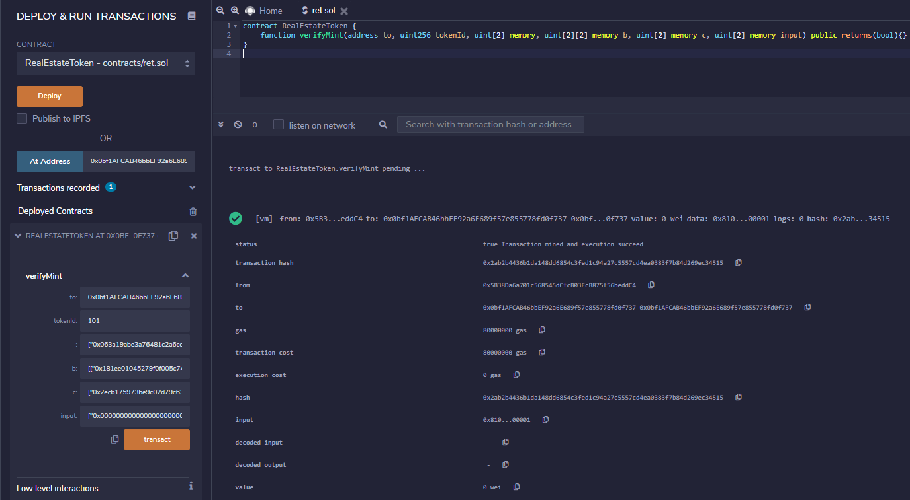

# Udacity Blockchain Capstone

The capstone will build upon the knowledge you have gained in the course in order to build a decentralized housing product. 

## Installation and Setup

This repository contains:
 * Smart Contract code in Solidity (using Truffle), 
 * Tests (also using Truffle), 
 * zk-snarks implementation (using Zokrates)

Necessary versions:
 * Truffle v5.0.20 (core: 5.0.20)
 * Solidity v0.5.0 (solc-js)
 * Node v10.16.0
 * Web3.js v1.0.0-beta.37

For installing necessary packages use:
`npm install`

## zkSNARKs Files
ZoKrates is a toolbox for zkSNARKs on Ethereum. The following steps were used to generate zero knowledge proofs and a verifier contract.

* Run ZoKrates docker container (inside zokrates directory):

`
docker run -v $PWD/code:/home/zokrates/code -ti zokrates/zokrates /bin/bash
`

* Compile the program written in ZoKrates DSL

` ~/zokrates compile -i square.code`

* Generate the Trusted Setup. Two keys are generated - 'proving.key' and 'verification.key'

`~/zokrates setup`

* Compute Witness

`~/zokrates compute-witness -a 3 9`

* Generate Proof based on the above 'witness'. A proof.json file is generated in this step

`~/zokrates generate-proof`

* Export Verifier smart contract

`~/zokrates export-verifier`


### Contract Test
Go inside the eth-contracts/test folder and run this commands: 
* `truffle develop`
* `test`

Result
```bash
Contract: TestERC721Mintable
    match erc721 spec
      √ should return total supply (129ms)
      √ should get token balance (211ms)
      √ should return token uri (162ms)
      √ should transfer token from one owner to another (962ms)
    have ownership properties
      √ should fail when minting when address is not contract owner (569ms)
      √ should return contract owner (166ms)

  Contract: TestSolnSquareVerifier
    Test for adding new solution for contract
      √ (token) can be minted for contract (1604ms)
    Test if an ERC721 token can be minted for contract
      √ (token) can be minted for contract (3905ms)

  Contract: TestSquareVerifier
    Test verification with correct proof
      √ Verificatons with correct proof succeeds (1055ms)
      √ Verificatons with incorrect proof succeeds (940ms)


  10 passing (28s)
```


### Contract Deployment
Run this command to compile contracts: 
`truffle compile`

To deploy contracts on Rinkeby network, download or clone the repo, run this command
```bash
truffle migrate --reset --network rinkeby
```

```bash
2_deploy_contracts.js
=====================

   Deploying 'SquareVerifier'
   --------------------------
   > block number:        8888657
   > block timestamp:     1625567346
   > account:             0x93865049B32E4e0cA35E39f79D7abd39DA1D1c4d
   > balance:             10.588225773000000001
   > gas used:            967811 (0xec483)
   > gas price:           2 gwei
   > value sent:          0 ETH
   > total cost:          0.001935622 ETH


   Deploying 'SolnSquareVerifier'
   ------------------------------
   > block number:        8888658
   > block timestamp:     1625567386
   > account:             0x93865049B32E4e0cA35E39f79D7abd39DA1D1c4d
   > balance:             10.581950375000000001
   > gas used:            3137699 (0x2fe0a3)
   > gas price:           2 gwei
   > value sent:          0 ETH
   > total cost:          0.006275398 ETH

   -------------------------------------
   > Total cost:          0.00821102 ETH


Summary
=======
> Total deployments:   3
> Final cost:          0.008631494 ETH


Starting migrations...      
======================      
> Network name:    'rinkeby'
> Network id:      4
> Block gas limit: 14974845 (0xe47f7d)


1_initial_migration.js
======================

   Deploying 'Migrations'
   ----------------------
   > transaction hash:    0xa608c44b31a713277d4cba1d38a3ecb17fcc03dfb949d2c0630268414fdf0d88
   > Blocks: 1            Seconds: 16
   > contract address:    0xaBfD36afD07b999B21f0bBfC82C7125c152E448f
   > block number:        8888663
   > block timestamp:     1625567429
   > account:             0x93865049B32E4e0cA35E39f79D7abd39DA1D1c4d
   > balance:             10.590410058000000001
   > gas used:            226537 (0x374e9)
   > gas price:           1 gwei
   > value sent:          0 ETH
   > total cost:          0.000226537 ETH


   > Saving migration to chain.
   > Saving artifacts
   -------------------------------------
   > Total cost:         0.000226537 ETH


2_deploy_contracts.js
=====================

   Deploying 'SquareVerifier'
   --------------------------
   > transaction hash:    0xea4a4d4bcfd43b6ec11cedb0843059cb7640c52c7d3d58956eee8ddbd7cf4d60
   > Blocks: 1            Seconds: 8
   > contract address:    0xbd04431F44326C9ef8373CF7691fBb0D31096548
   > block number:        8888665
   > block timestamp:     1625567459
   > account:             0x93865049B32E4e0cA35E39f79D7abd39DA1D1c4d
   > balance:             10.589396484000000001
   > gas used:            967811 (0xec483)
   > gas price:           1 gwei
   > value sent:          0 ETH
   > total cost:          0.000967811 ETH


   Deploying 'SolnSquareVerifier'
   ------------------------------
   > transaction hash:    0x3d66e9f492fcba1d23c9da66ebbec31e3db9b642a235e571fefe978a1682a054
   > Blocks: 1            Seconds: 8
   > contract address:    0x0bf1AFCAB46bbEF92a6E689f57e855778fd0f737
   > block number:        8888666
   > block timestamp:     1625567474
   > account:             0x93865049B32E4e0cA35E39f79D7abd39DA1D1c4d
   > balance:             10.586079985000000001
   > gas used:            3316499 (0x329b13)
   > gas price:           1 gwei
   > value sent:          0 ETH
   > total cost:          0.003316499 ETH


   > Saving migration to chain.
   > Saving artifacts
   -------------------------------------
   > Total cost:          0.00428431 ETH


Summary
=======
> Total deployments:   3
> Final cost:          0.004510847 ETH
```


`Contract Address: 0x0bf1AFCAB46bbEF92a6E689f57e855778fd0f737`

## Minting Tokens
One of the solutions for minting tokens is to use Remix


## OpenSea

* MarketPlace URL: https://testnets.opensea.io/assets/ret-houses

Buy Transactions:
 * Tx1: 0x7231a0e917d2d97479ade846b48cb93a6c8295ba169ea4527e1227bc002a3dc7
 * Tx2: 0xe08b85e8f30bf2a30915f2562de97e06bf7729ed31700f2dd0e7c7e752eb2a5
 * Tx3: 0x966ff8ae4037db5cc6a52126848b54b87799ab0150b424e3458810fe8050b862
 * Tx4: 0x58abe9b65f7ca44435aa54ad0065e10c6882fbca35d4a56a44c93f7b2517180e
 * Tx5: 0x020d700a8f3e40247f4f3769ab81ceeaa44c44fefcb17fe403139e4e0bacaad0


## Project ABI
```bash
"abi": [
    {
      "inputs": [
        {
          "internalType": "address",
          "name": "squareVerifierContractAddress",
          "type": "address"
        }
      ],
      "payable": false,
      "stateMutability": "nonpayable",
      "type": "constructor"
    },
    {
      "anonymous": false,
      "inputs": [
        {
          "indexed": false,
          "internalType": "uint256",
          "name": "index",
          "type": "uint256"
        },
        {
          "indexed": false,
          "internalType": "address",
          "name": "provider",
          "type": "address"
        }
      ],
      "name": "AddedSolution",
      "type": "event"
    },
    {
      "anonymous": false,
      "inputs": [
        {
          "indexed": true,
          "internalType": "address",
          "name": "owner",
          "type": "address"
        },
        {
          "indexed": true,
          "internalType": "address",
          "name": "approved",
          "type": "address"
        },
        {
          "indexed": true,
          "internalType": "uint256",
          "name": "tokenId",
          "type": "uint256"
        }
      ],
      "name": "Approval",
      "type": "event"
    },
    {
      "anonymous": false,
      "inputs": [
        {
          "indexed": true,
          "internalType": "address",
          "name": "owner",
          "type": "address"
        },
        {
          "indexed": true,
          "internalType": "address",
          "name": "operator",
          "type": "address"
        },
        {
          "indexed": false,
          "internalType": "bool",
          "name": "approved",
          "type": "bool"
        }
      ],
      "name": "ApprovalForAll",
      "type": "event"
    },
    {
      "anonymous": false,
      "inputs": [
        {
          "indexed": false,
          "internalType": "address",
          "name": "caller",
          "type": "address"
        }
      ],
      "name": "Paused",
      "type": "event"
    },
    {
      "anonymous": false,
      "inputs": [
        {
          "indexed": true,
          "internalType": "address",
          "name": "from",
          "type": "address"
        },
        {
          "indexed": true,
          "internalType": "address",
          "name": "to",
          "type": "address"
        },
        {
          "indexed": true,
          "internalType": "uint256",
          "name": "tokenId",
          "type": "uint256"
        }
      ],
      "name": "Transfer",
      "type": "event"
    },
    {
      "anonymous": false,
      "inputs": [
        {
          "indexed": false,
          "internalType": "address",
          "name": "caller",
          "type": "address"
        }
      ],
      "name": "Unpaused",
      "type": "event"
    },
    {
      "anonymous": false,
      "inputs": [
        {
          "indexed": false,
          "internalType": "address",
          "name": "_owner",
          "type": "address"
        }
      ],
      "name": "ownerShip",
      "type": "event"
    },
    {
      "constant": false,
      "inputs": [
        {
          "internalType": "bytes32",
          "name": "_myid",
          "type": "bytes32"
        },
        {
          "internalType": "string",
          "name": "_result",
          "type": "string"
        }
      ],
      "name": "__callback",
      "outputs": [],
      "payable": false,
      "stateMutability": "nonpayable",
      "type": "function"
    },
    {
      "constant": false,
      "inputs": [
        {
          "internalType": "bytes32",
          "name": "_myid",
          "type": "bytes32"
        },
        {
          "internalType": "string",
          "name": "_result",
          "type": "string"
        },
        {
          "internalType": "bytes",
          "name": "_proof",
          "type": "bytes"
        }
      ],
      "name": "__callback",
      "outputs": [],
      "payable": false,
      "stateMutability": "nonpayable",
      "type": "function"
    },
    {
      "constant": false,
      "inputs": [
        {
          "internalType": "address",
          "name": "to",
          "type": "address"
        },
        {
          "internalType": "uint256",
          "name": "tokenId",
          "type": "uint256"
        }
      ],
      "name": "approve",
      "outputs": [],
      "payable": false,
      "stateMutability": "nonpayable",
      "type": "function"
    },
    {
      "constant": true,
      "inputs": [
        {
          "internalType": "address",
          "name": "owner",
          "type": "address"
        }
      ],
      "name": "balanceOf",
      "outputs": [
        {
          "internalType": "uint256",
          "name": "",
          "type": "uint256"
        }
      ],
      "payable": false,
      "stateMutability": "view",
      "type": "function"
    },
    {
      "constant": true,
      "inputs": [],
      "name": "baseTokenURI",
      "outputs": [
        {
          "internalType": "string",
          "name": "",
          "type": "string"
        }
      ],
      "payable": false,
      "stateMutability": "view",
      "type": "function"
    },
    {
      "constant": true,
      "inputs": [
        {
          "internalType": "uint256",
          "name": "tokenId",
          "type": "uint256"
        }
      ],
      "name": "getApproved",
      "outputs": [
        {
          "internalType": "address",
          "name": "",
          "type": "address"
        }
      ],
      "payable": false,
      "stateMutability": "view",
      "type": "function"
    },
    {
      "constant": true,
      "inputs": [
        {
          "internalType": "address",
          "name": "owner",
          "type": "address"
        },
        {
          "internalType": "address",
          "name": "operator",
          "type": "address"
        }
      ],
      "name": "isApprovedForAll",
      "outputs": [
        {
          "internalType": "bool",
          "name": "",
          "type": "bool"
        }
      ],
      "payable": false,
      "stateMutability": "view",
      "type": "function"
    },
    {
      "constant": false,
      "inputs": [
        {
          "internalType": "address",
          "name": "to",
          "type": "address"
        },
        {
          "internalType": "uint256",
          "name": "tokenId",
          "type": "uint256"
        }
      ],
      "name": "mint",
      "outputs": [
        {
          "internalType": "bool",
          "name": "",
          "type": "bool"
        }
      ],
      "payable": false,
      "stateMutability": "nonpayable",
      "type": "function"
    },
    {
      "constant": true,
      "inputs": [],
      "name": "name",
      "outputs": [
        {
          "internalType": "string",
          "name": "",
          "type": "string"
        }
      ],
      "payable": false,
      "stateMutability": "view",
      "type": "function"
    },
    {
      "constant": true,
      "inputs": [],
      "name": "owner",
      "outputs": [
        {
          "internalType": "address",
          "name": "",
          "type": "address"
        }
      ],
      "payable": false,
      "stateMutability": "view",
      "type": "function"
    },
    {
      "constant": true,
      "inputs": [
        {
          "internalType": "uint256",
          "name": "tokenId",
          "type": "uint256"
        }
      ],
      "name": "ownerOf",
      "outputs": [
        {
          "internalType": "address",
          "name": "",
          "type": "address"
        }
      ],
      "payable": false,
      "stateMutability": "view",
      "type": "function"
    },
    {
      "constant": false,
      "inputs": [
        {
          "internalType": "address",
          "name": "from",
          "type": "address"
        },
        {
          "internalType": "address",
          "name": "to",
          "type": "address"
        },
        {
          "internalType": "uint256",
          "name": "tokenId",
          "type": "uint256"
        }
      ],
      "name": "safeTransferFrom",
      "outputs": [],
      "payable": false,
      "stateMutability": "nonpayable",
      "type": "function"
    },
    {
      "constant": false,
      "inputs": [
        {
          "internalType": "address",
          "name": "from",
          "type": "address"
        },
        {
          "internalType": "address",
          "name": "to",
          "type": "address"
        },
        {
          "internalType": "uint256",
          "name": "tokenId",
          "type": "uint256"
        },
        {
          "internalType": "bytes",
          "name": "_data",
          "type": "bytes"
        }
      ],
      "name": "safeTransferFrom",
      "outputs": [],
      "payable": false,
      "stateMutability": "nonpayable",
      "type": "function"
    },
    {
      "constant": false,
      "inputs": [
        {
          "internalType": "address",
          "name": "to",
          "type": "address"
        },
        {
          "internalType": "bool",
          "name": "approved",
          "type": "bool"
        }
      ],
      "name": "setApprovalForAll",
      "outputs": [],
      "payable": false,
      "stateMutability": "nonpayable",
      "type": "function"
    },
    {
      "constant": false,
      "inputs": [
        {
          "internalType": "bool",
          "name": "pauseStatus",
          "type": "bool"
        }
      ],
      "name": "setPausedStatus",
      "outputs": [],
      "payable": false,
      "stateMutability": "nonpayable",
      "type": "function"
    },
    {
      "constant": true,
      "inputs": [
        {
          "internalType": "bytes4",
          "name": "interfaceId",
          "type": "bytes4"
        }
      ],
      "name": "supportsInterface",
      "outputs": [
        {
          "internalType": "bool",
          "name": "",
          "type": "bool"
        }
      ],
      "payable": false,
      "stateMutability": "view",
      "type": "function"
    },
    {
      "constant": true,
      "inputs": [],
      "name": "symbol",
      "outputs": [
        {
          "internalType": "string",
          "name": "",
          "type": "string"
        }
      ],
      "payable": false,
      "stateMutability": "view",
      "type": "function"
    },
    {
      "constant": true,
      "inputs": [
        {
          "internalType": "uint256",
          "name": "index",
          "type": "uint256"
        }
      ],
      "name": "tokenByIndex",
      "outputs": [
        {
          "internalType": "uint256",
          "name": "",
          "type": "uint256"
        }
      ],
      "payable": false,
      "stateMutability": "view",
      "type": "function"
    },
    {
      "constant": true,
      "inputs": [
        {
          "internalType": "address",
          "name": "owner",
          "type": "address"
        },
        {
          "internalType": "uint256",
          "name": "index",
          "type": "uint256"
        }
      ],
      "name": "tokenOfOwnerByIndex",
      "outputs": [
        {
          "internalType": "uint256",
          "name": "",
          "type": "uint256"
        }
      ],
      "payable": false,
      "stateMutability": "view",
      "type": "function"
    },
    {
      "constant": true,
      "inputs": [
        {
          "internalType": "uint256",
          "name": "tokenId",
          "type": "uint256"
        }
      ],
      "name": "tokenURI",
      "outputs": [
        {
          "internalType": "string",
          "name": "",
          "type": "string"
        }
      ],
      "payable": false,
      "stateMutability": "view",
      "type": "function"
    },
    {
      "constant": true,
      "inputs": [],
      "name": "totalSupply",
      "outputs": [
        {
          "internalType": "uint256",
          "name": "",
          "type": "uint256"
        }
      ],
      "payable": false,
      "stateMutability": "view",
      "type": "function"
    },
    {
      "constant": false,
      "inputs": [
        {
          "internalType": "address",
          "name": "from",
          "type": "address"
        },
        {
          "internalType": "address",
          "name": "to",
          "type": "address"
        },
        {
          "internalType": "uint256",
          "name": "tokenId",
          "type": "uint256"
        }
      ],
      "name": "transferFrom",
      "outputs": [],
      "payable": false,
      "stateMutability": "nonpayable",
      "type": "function"
    },
    {
      "constant": false,
      "inputs": [
        {
          "internalType": "address",
          "name": "newOwner",
          "type": "address"
        }
      ],
      "name": "transferOwnership",
      "outputs": [],
      "payable": false,
      "stateMutability": "nonpayable",
      "type": "function"
    },
    {
      "constant": false,
      "inputs": [
        {
          "internalType": "address",
          "name": "to",
          "type": "address"
        },
        {
          "internalType": "uint256",
          "name": "tokenId",
          "type": "uint256"
        },
        {
          "internalType": "uint256[2]",
          "name": "a",
          "type": "uint256[2]"
        },
        {
          "internalType": "uint256[2][2]",
          "name": "b",
          "type": "uint256[2][2]"
        },
        {
          "internalType": "uint256[2]",
          "name": "c",
          "type": "uint256[2]"
        },
        {
          "internalType": "uint256[2]",
          "name": "input",
          "type": "uint256[2]"
        }
      ],
      "name": "verifyMint",
      "outputs": [
        {
          "internalType": "bool",
          "name": "",
          "type": "bool"
        }
      ],
      "payable": false,
      "stateMutability": "nonpayable",
      "type": "function"
    }
  ]
```

# Project Resources

* [Remix - Solidity IDE](https://remix.ethereum.org/)
* [Visual Studio Code](https://code.visualstudio.com/)
* [Truffle Framework](https://truffleframework.com/)
* [Ganache - One Click Blockchain](https://truffleframework.com/ganache)
* [Open Zeppelin ](https://openzeppelin.org/)
* [Interactive zero knowledge 3-colorability demonstration](http://web.mit.edu/~ezyang/Public/graph/svg.html)
* [Docker](https://docs.docker.com/install/)
* [ZoKrates](https://github.com/Zokrates/ZoKrates)
